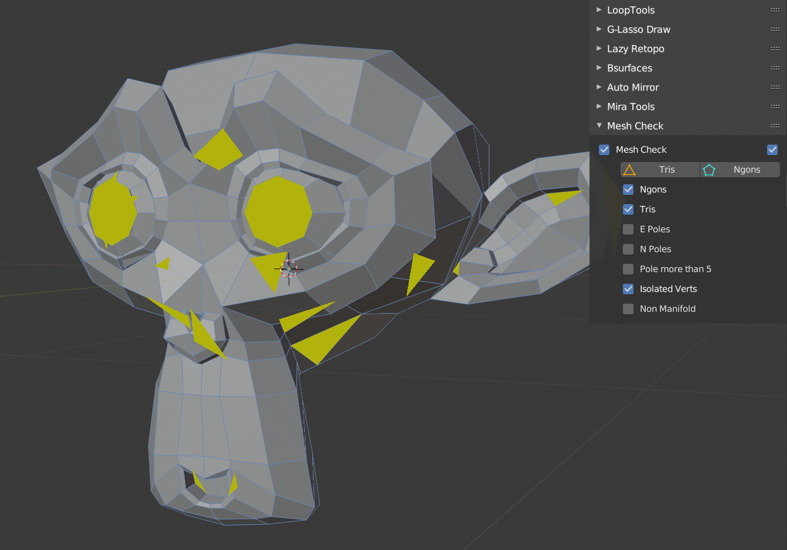

# Mesh Check

Mesh Check allows you to display triangle and ngons directly in the 3D view by 
dyeing them so you can see them quickly. 

 

Blender2.8へアップデート作業途中。 
細かなメニューなどは対応させたが、 
メイン機能の描画方法をbglからgpuへ変更させなくてはならない。 

## 旧版のBlender2.8 ver

マテリアルを使用する古いバージョンは、すでにBlender2.8にアップデートしている。 
Blender Add-on : Mesh Check [Ngons / Tris Checker Blender2.8] 
https://gumroad.com/l/tsYGF

## 進捗

Mesh Check ver1.0.0 三角形をハイライト表示することができた。しかしバグが多くある
2019-10-31
- 裏面が表示されて邪魔
- Nゴンが正しく表示されない
- Nゴンを作ると、三角形が消える(消えないポリゴンもある)
- 色の透明度が反映されていない

 
